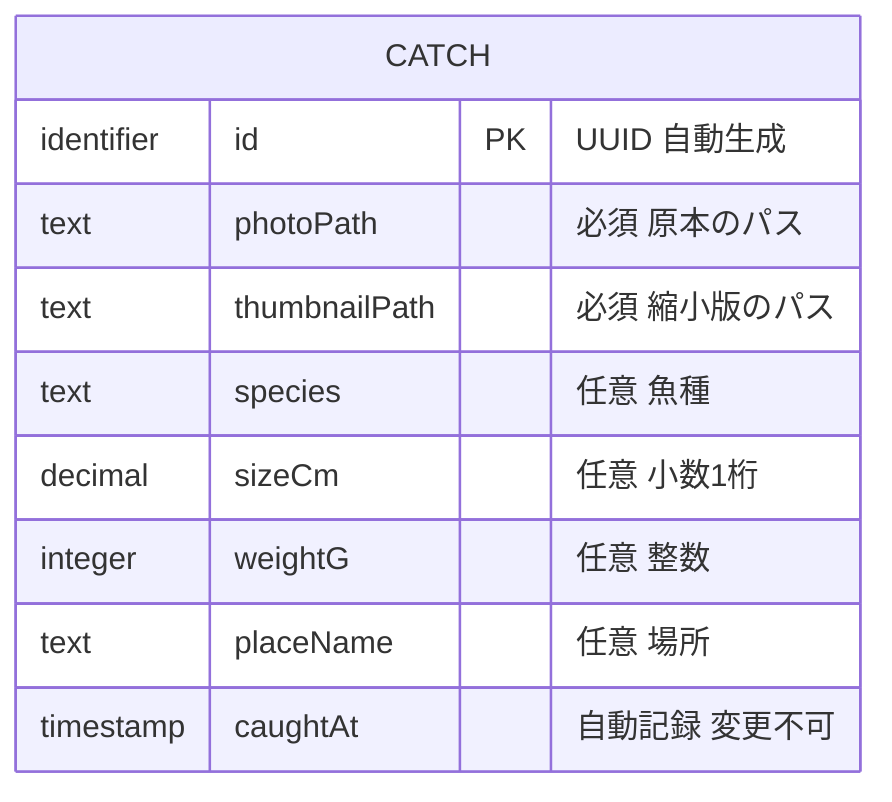

# Functional Spec — catches（機能仕様）

## Sources

- 上流資料: `../../../inception/units-generation/unit-of-work.md`（unit-of-work: U1 catches、kind ui）、`../../../inception/units-generation/unit-of-work-story-map.md`（unit-of-work-story-map: FR → U1）、`../../../inception/requirements-analysis/requirements.md`（requirements: FR1〜FR4、NFR1〜NFR9）、`../../../inception/domain-design/components.md`（components: CatchUI → CatchLog → CatchStore）、`../../../inception/domain-design/decisions.md`（ADR-001〜006）、`../../../ideation/rough-mockups/wireframes.md`（S1／S2／S3）、`../../../ideation/rough-mockups/user-flow.md`
- 本工程の確認済み回答: `functional-design-questions.md` の Q1〜Q4
- 補助資料: `entities.md`（データの形の源泉）、`rules.md`（業務ルールの源泉、`BRx.y`）

## Overview（この資料の役割）

作業単位 U1 `catches` の振る舞いを定める。操作の流れ（ワークフロー）と状態遷移はこの資料が源泉。データの形は `entities.md`、業務ルールは `rules.md` が源泉で、ここではそれぞれの導出ビュー（ER 図・ルール要約）を載せる。技術に依存しない書き方をし、実装の細部（ライブラリ・SQL・コード）は Code Generation で決める。

部品の関係（components）: CatchUI（画面）→ CatchLog（ルール・検証・並び順・絞り込み）→ CatchStore（保存・写真ファイル）。画面は CatchStore を直接呼ばない。

## Entity Relationship（導出ビュー — 源泉は entities.md）

<!-- Text fallback: エンティティは CATCH の1つ。id（UUID）、photoPath と thumbnailPath（必須）、species・sizeCm・weightG・placeName（任意）、caughtAt（自動記録）を持ち、他との関係はない。 -->

## Workflows（操作の流れ — 源泉）

### WF-1: 釣果を登録する（FR1）

- 起点: S1 一覧の（＋）ボタン、または空の状態の「釣果を登録する」
- 関係する部品: CatchUI → CatchLog → CatchStore
- 前提: 保存領域が初期化済み（BR4.5 を通過している）

1. CatchUI が S2 登録画面を開く。すべての項目は空、写真はなし。
2. 利用者が「カメラで撮る」または「写真を選ぶ」を押す → CatchUI がその操作に必要な許可を要求する（BR5.2）。
   - 拒否された場合: 写真項目の位置に「写真を添付するには許可が必要です」と「設定を開く」を表示する（BR5.1）。写真は未添付のまま。
   - 許可された場合: 撮影または選択の結果として、端末上の一時的な写真の参照を受け取り、プレビューを表示する。
3. 利用者が魚種・サイズ・重さ・場所を任意で入力する。場所欄の入力中は CatchLog に候補を問い合わせ、過去の場所名を最大 5 件表示する（BR6.1）。タップで入力欄に入る。
4. 利用者が「保存する」を押す → CatchUI が「保存する」を「保存中...」にして無効化し（BR4.2）、入力内容と写真の参照を CatchLog に渡す。
5. CatchLog が検証する（BR1.1〜BR1.4）。
   - 違反があれば: 違反した項目ごとの文言を返す。CatchUI は各項目の直下に表示し、「保存する」を有効に戻す。入力は保持する。
   - 違反がなければ: id（UUID、BR1.6）と caughtAt（注入された時計、BR1.5）を付与し、CatchStore に保存を依頼する。
6. CatchStore が写真をアプリ専用領域にコピーし、縮小版を生成し（BR4.3）、Catch を1行として保存する。
   - いずれかが失敗: 途中で作ったファイルを消し、失敗を返す。
7. 結果を CatchUI が受け取る。
   - 成功: S1 一覧に戻り、保存した釣果が先頭に表示される。
   - 失敗: 画面上部に「保存できませんでした。もう一度お試しください」を表示し、入力と写真プレビューを保持し、「保存する」を有効に戻す（BR4.1）。

- 途中で「戻る」: 入力または写真があれば「入力を破棄しますか？」を出す（BR7.1）。承諾で S1 へ、キャンセルで S2 に留まる。

### WF-2: 一覧を見る・絞り込む（FR2）

- 起点: アプリの起動、S2 の保存完了、S3 からの戻る
- 関係する部品: CatchUI → CatchLog → CatchStore

1. アプリ起動時、CatchStore が保存領域を初期化する。失敗したら「保存領域を準備できませんでした。アプリを再起動してください」を表示して止まる（BR4.5）。
2. CatchUI が S1 を開き、CatchLog に一覧（絞り込みなし）と絞り込み候補（魚種・場所）を要求する。読み込み中はカードの形の枠を表示する。
3. CatchLog が CatchStore から caughtAt の降順で取得し（BR2.1）、候補は登録済みの魚種・場所の重複なしの集合を返す（BR2.3）。
4. CatchUI が表示する。
   - 釣果0件: 空の状態（「まだ釣果がありません」＋「釣果を登録する」）。
   - 1件以上: 写真（縮小版）・魚種・サイズ／重さ・場所・日付のカードを縦に並べる。未入力の項目は出さず、魚種・場所は1行に省略する（BR7.2）。
   - 読み込み失敗: 「釣果を読み込めませんでした」と「再読み込み」（BR4.6）。
5. 利用者が上部のチップで魚種または場所を選ぶ → CatchUI が CatchLog に絞り込み条件付きの一覧を要求する。両方選んだときは AND（BR2.2）。もう一度タップで解除。
6. 絞り込み結果が0件なら「該当する釣果がありません」を表示し、解除を促す（BR2.4）。
7. カードをタップ → WF-3 へ。（＋）をタップ → WF-1 へ。

### WF-3: 詳細を見る・削除する（FR3）

- 起点: S1 のカードをタップ
- 関係する部品: CatchUI → CatchLog → CatchStore

1. CatchUI が S3 を開き、CatchLog に id で1件を要求する。
2. CatchLog が CatchStore から取得して返す。取得できなければ「表示できませんでした」と「戻る」。
3. CatchUI が大きな写真（原本）・魚種・サイズ／重さ・場所・日時を表示する。未入力の項目は出さない（BR7.2）。
4. 利用者が「削除」を押す → 「この釣果を削除しますか？」の確認（BR3.1）。
   - キャンセル: S3 に留まる。
   - 削除する: CatchLog が CatchStore に削除を依頼する。行の削除に成功してから写真の原本と縮小版を消す（BR3.2）。
5. 削除に成功したら S1 に戻り、一覧からその釣果が消えている。行の削除に失敗したら「削除できませんでした」を表示して S3 に留まる。
6. 「戻る」で S1 へ。

### WF-4: 起動と保存領域の初期化（FR4）

1. 起動時に CatchUI（AppShell）が CatchLog に保存領域の準備を依頼し、CatchLog が CatchStore に初期化（データベースとアプリ専用のファイル領域）を依頼する。既存のデータがあればそのまま使う（FR4.1）。
2. 初期化に失敗したら致命的エラーとして扱い、一覧を出さずに文言を表示する（BR4.5）。
3. 通信は一切使わない（BR4.4）。

## State Machines（状態遷移 — 源泉）

### 登録画面（S2）の状態

| 現在の状態 | イベント | 条件 | 次の状態 | 動作 |
|------------|----------|------|----------|------|
| 空 | 写真の添付操作 | 許可あり | 写真あり | プレビュー表示 |
| 空 | 写真の添付操作 | 許可拒否 | 許可なし | 案内と「設定を開く」を表示（BR5.1） |
| 許可なし | 設定から戻り再操作 | 許可あり | 写真あり | プレビュー表示 |
| 空／写真あり／許可なし | 項目の入力 | — | 同じ状態 | 入力を保持（許可なしの案内は残す） |
| 写真あり | 保存する | — | 保存中 | ボタン無効化（BR4.2）、検証へ |
| 空／許可なし | 保存する | 写真なし | 検証エラー | 「写真を添付してください」（BR1.1）。許可なしの案内も残す |
| 許可なし | 戻る | 入力あり | 破棄確認 | 「入力を破棄しますか？」（BR7.1） |
| 許可なし | 戻る | 入力なし | 終了 | S1 へ（確認なし） |
| 保存中 | 検証違反 | — | 検証エラー | 項目直下に文言、ボタン有効化 |
| 保存中 | 保存成功 | — | 完了 | S1 へ戻る（先頭に表示） |
| 保存中 | 保存失敗 | — | 保存失敗 | 上部に文言、入力保持、ボタン有効化（BR4.1） |
| 検証エラー／保存失敗 | 項目の修正 | — | 写真あり／空 | 文言を消す |
| 空以外 | 戻る | 入力または写真あり | 破棄確認 | 「入力を破棄しますか？」（BR7.1） |
| 破棄確認 | 承諾 | — | 終了 | S1 へ |
| 破棄確認 | キャンセル | — | 元の状態 | 留まる |
| 空 | 戻る | 入力なし | 終了 | S1 へ（確認なし） |

- 初期状態: 空。終端状態: 完了、終了。

### 一覧画面（S1）の状態

| 現在の状態 | イベント | 条件 | 次の状態 | 動作 |
|------------|----------|------|----------|------|
| 読み込み中 | 取得成功 | 0件 | 空 | 空の状態を表示 |
| 読み込み中 | 取得成功 | 1件以上 | 一覧 | カードを表示、チップの候補を表示 |
| 読み込み中 | 取得失敗 | — | 読み込み失敗 | 文言＋再読み込み（BR4.6） |
| 読み込み失敗 | 再読み込み | — | 読み込み中 | 再取得 |
| 一覧 | チップ選択 | — | 読み込み中（絞り込み） | 条件付き取得（BR2.2） |
| 読み込み中（絞り込み） | 取得成功 | 0件 | 該当なし | 「該当する釣果がありません」（BR2.4） |
| 読み込み中（絞り込み） | 取得成功 | 1件以上 | 一覧（絞り込み中） | 選択中のチップを強調 |
| 一覧（絞り込み中）／該当なし | チップ解除 | — | 読み込み中 | 条件なしで再取得 |
| 一覧／一覧（絞り込み中）／空／該当なし | （＋） | — | 登録へ | WF-1 |
| 一覧／一覧（絞り込み中） | カードをタップ | — | 詳細へ | WF-3 |
| 登録へ／詳細へ | 戻る・保存完了・削除完了 | — | 読み込み中 | 再取得（絞り込み条件は保持したまま再取得する） |

- 初期状態: 読み込み中。終端状態: なし（常駐画面）。

### 釣果（Catch）のライフサイクル

| 現在の状態 | イベント | 条件 | 次の状態 | 動作 |
|------------|----------|------|----------|------|
| （なし） | 保存成功 | 検証通過・写真取り込み成功 | 保存済み | 行と原本・縮小版が存在 |
| 保存済み | 削除の承諾 | 行の削除成功 | 削除済み | 原本・縮小版を削除（BR3.2） |
| 保存済み | 削除の承諾 | 行の削除失敗 | 保存済み | 「削除できませんでした」 |

- 編集（内容の変更）は最小範囲では存在しない（FR3.3）。

## Rules Summary（導出ビュー — 源泉は rules.md）

| グループ | ルール | 対象 |
|----------|--------|------|
| 登録の検証 | BR1.1 写真必須／BR1.2 サイズ／BR1.3 重さ／BR1.4 魚種・場所 | WF-1 手順5 |
| 自動付与 | BR1.5 日時／BR1.6 UUID | WF-1 手順5 |
| 一覧 | BR2.1 新しい順／BR2.2 AND 絞り込み／BR2.3 候補／BR2.4 該当なし | WF-2 |
| 削除 | BR3.1 確認付き／BR3.2 行と写真をまとめて | WF-3 |
| 保存と失敗 | BR4.1 入力保持／BR4.2 二重送信防止／BR4.3 コピー＋縮小版／BR4.4 通信なし／BR4.5 初期化失敗／BR4.6 読み込み失敗 | WF-1, WF-2, WF-4 |
| 許可 | BR5.1 拒否時の案内／BR5.2 操作の直前に要求 | WF-1 手順2 |
| 入力補助 | BR6.1 場所の候補 | WF-1 手順3 |
| 表示 | BR7.1 破棄確認／BR7.2 未入力の非表示と省略 | WF-1, WF-2, WF-3 |

## Interfaces（部品間の操作 — 名前と入出力のみ）

| 呼び出し元 → 先 | 操作 | 入力 | 出力 |
|-----------------|------|------|------|
| CatchUI → CatchLog | 釣果を保存する | 写真の参照、魚種、サイズ、重さ、場所 | 成功（保存した Catch）／検証エラー（項目ごとの文言）／保存失敗（理由） |
| CatchUI → CatchLog | 一覧を取得する | 絞り込み条件（魚種、場所、いずれも任意） | Catch の配列（新しい順）／読み込み失敗 |
| CatchUI → CatchLog | 絞り込み候補を取得する | なし | 魚種の配列、場所の配列（重複なし） |
| CatchUI → CatchLog | 場所の候補を取得する | 入力中の文字 | 場所名の配列（最大 5 件） |
| CatchUI → CatchLog | 1件を取得する | id | Catch／見つからない |
| CatchUI → CatchLog | 削除する | id | 成功／失敗（理由） |
| CatchLog → CatchStore | 写真を取り込む | 一時的な写真の参照 | 原本と縮小版のパス／失敗 |
| CatchLog → CatchStore | 行を保存する | Catch | 成功／失敗 |
| CatchLog → CatchStore | 一覧を読む | 並び順、絞り込み条件 | Catch の配列 |
| CatchLog → CatchStore | 重複なしの値を読む | 属性名（魚種／場所） | 値の配列（新しい順） |
| CatchLog → CatchStore | 1件を読む | id | Catch／なし |
| CatchLog → CatchStore | 行と写真を削除する | id | 成功／失敗 |
| CatchUI（AppShell）→ CatchLog | 保存領域を準備する | なし | 成功／致命的失敗 |
| CatchLog → CatchStore | 保存領域を初期化する | なし | 成功／致命的失敗 |

- CatchLog は時計と ID 生成器を注入で受け取る（テストで固定するため）。
- すべての失敗は理由付きの結果として返し、握りつぶさない（team-practices のエラー処理）。

## Error Catalog（利用者に見える文言）

| 場面 | 文言 | 復帰 |
|------|------|------|
| 写真未添付で保存 | 写真を添付してください | 写真を添付して再度保存 |
| サイズが不正 | サイズは数字で入力してください（小数は1桁まで） | 修正して再度保存 |
| 重さが不正 | 重さは整数で入力してください | 修正して再度保存 |
| 文字数超過 | 50 文字以内で入力してください | 修正して再度保存 |
| 保存失敗 | 保存できませんでした。もう一度お試しください | 再度保存（入力は保持） |
| 許可拒否 | 写真を添付するには許可が必要です ＋「設定を開く」 | 設定で許可して戻る |
| 一覧の読み込み失敗 | 釣果を読み込めませんでした ＋「再読み込み」 | 再読み込み |
| 絞り込み0件 | 該当する釣果がありません | チップを解除 |
| 詳細の読み込み失敗 | 表示できませんでした ＋「戻る」 | 一覧へ |
| 削除失敗 | 削除できませんでした | 再度削除 |
| 保存領域の初期化失敗 | 保存領域を準備できませんでした。アプリを再起動してください | 再起動 |
| 破棄確認 | 入力を破棄しますか？ | 承諾／キャンセル |
| 削除確認 | この釣果を削除しますか？ | 削除する／キャンセル |

## Business Scenarios（通しのシナリオ）

- **正常系（次の釣行）**: 起動 → 空の状態 → 登録（撮影＋魚種＋サイズ＋場所）→ 保存 → 一覧の先頭に表示 → もう1件登録 → チップ「アジ」で絞り込み → 解除 → カードをタップして詳細 → 戻る。アプリを完全終了して再起動しても2件が残る。
- **入力の不備**: 写真なしで保存 → 文言 → 写真を添付 → サイズに「abc」→ 文言 → 修正 → 保存成功。
- **許可拒否**: 初回の撮影で拒否 → 案内と「設定を開く」→ 設定で許可 → 戻って撮影できる。
- **保存失敗**: 保存領域が書けない状態で保存 → 上部に文言、入力は残る → 再試行。
- **削除**: 詳細で削除 → 確認 → キャンセル（残る）→ 削除 → 承諾（消える）→ 再起動しても戻らない。
- **電波なし**: 機内モードで上記すべてが動く（BR4.4）。

## Assumptions & Open Questions

- 一覧の日付表示は「M/D」とし、当年以外は「YYYY/M/D」とする。詳細では「YYYY/M/D H:mm」とする。要件で形式は定められていないため設計で決めた。[assumption]
- 写真の原本のコピーと縮小版の生成にかかる時間は、保存の操作から一覧に戻るまで 2 秒以内を目安とする（NFR8 の使いやすさから導出。要件の数値ではない）。[assumption]
- 絞り込みチップの候補が多い（20 件超）場合の表示方法は、次の釣行の後に検討する。[assumption]
