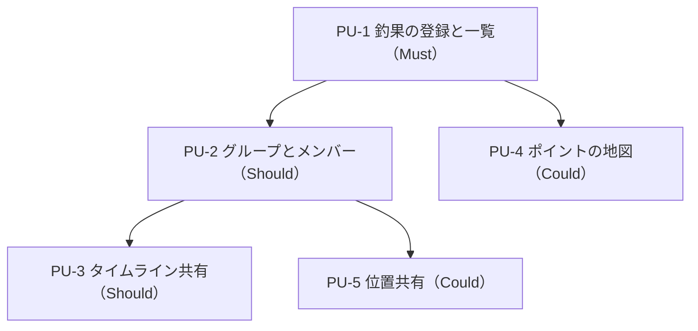

# Intent Backlog — 友達と使う釣りアプリ

## Sources

- 上流資料: `../intent-capture/intent-statement.md`（intent-statement）— 中心機能3つ、最優先は釣果の記録・共有、期限は次の釣行（1〜2週間以内）
- 本工程の確認済み回答: `scope-definition-questions.md` の Q1〜Q8（本文中では `[Q<n>]` で参照）
- 範囲の境界: `scope-document.md`

## Prioritized Backlog（優先順位付きの機能一覧）

優先度は MoSCoW（Must＝必ず作る／Should＝できれば作る／Could＝余裕があれば／Won't＝今回は作らない）。順番は価値優先の並び。[Q7]

| ID | 候補機能（proto-Unit） | 内容 | 優先度 | 期限 | 依存 | Source |
|----|------------------------|------|--------|------|------|--------|
| PU-1 | 釣果の登録と一覧 | 写真／魚種／サイズ・重さ／場所を1件ずつ登録し、一覧で見られる。スマホ画面で使える | Must | 次の釣行（1〜2週間以内） | なし | [Q1][Q3][Q8] |
| PU-2 | グループとメンバー | グループを作り、友達の知り合いが招待リンク・招待コードで参加できる | Should | 次の釣行の後 | PU-1 | [Q5] |
| PU-3 | 釣果のタイムライン共有 | グループ全員の釣果が新しい順に並ぶ | Should | 次の釣行の後 | PU-1, PU-2 | [Q2] |
| PU-4 | ポイントの地図 | 地図上にピンを立ててメモを書ける。釣果の「場所」とも関連する | Could | 次の釣行の後 | PU-1 | [Q6] |
| PU-5 | 釣行中の位置共有 | 今いる場所を地図上でグループに共有する | Could | 次の釣行の後（最後） | PU-2 | [Q4][Q7] |
| — | 公開・デプロイ | 友達が各自の端末から使える状態にする | Won't（今回） | 別の作業 | — | intent-statement（公開は範囲外） |
| — | 運用・監視 | 動かし続けるための仕組み | Won't（今回） | 別の作業 | — | scope-document（Out of Scope） |

## Dependencies（依存関係）

- PU-3（タイムライン共有）は PU-2（グループ）が前提。「誰の釣果か」「どのグループに見せるか」が要るため。[Q2][Q5]
- PU-5（位置共有）も PU-2（グループ）が前提。共有先がグループのため。[Q4]
- PU-4（ポイントの地図）は PU-1 の「場所」と関連するが、単独でも作れる。[Q6]
- PU-1 は何にも依存しない。次の釣行までの最小範囲はこれ1つ。[Q3]

<!-- Text fallback: PU-1 が土台。PU-2 は PU-1 の後、PU-3 と PU-5 は PU-2 の後、PU-4 は PU-1 の後に作れる。 -->

## Delivery Notes（デリバリーリードの視点）

- 期限のある仕事は PU-1 だけに絞られているので、1〜2週間で「登録と一覧」を確実に動かすことに集中できる。intent-statement の成功の姿もこれで満たせる。[Q3]
- PU-2 以降は期限の対象外。次の釣行で実際に使った感触をもとに、PU-2〜PU-5 の順番や中身を見直してよい。[Q7]
- PU-5（位置共有）は作る量がいちばん多く、地図と位置情報の扱いを含む。最後に置くことで、先に PU-4 で地図の扱いに慣れてから取り組める。[Q4][Q6][Q7]

## Assumptions & Open Questions

- PU-2 で「グループは1つだけ」か「複数作れる」かは未確定。要件整理で確認する。[assumption]
- PU-1 の一覧に並べ替え・絞り込み（魚種別・場所別など）が要るかは未確定。要件整理で確認する。[assumption]
