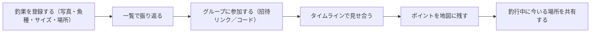

# Scope Document — 友達と使う釣りアプリ

## Sources

- 上流資料: `../intent-capture/intent-statement.md`（intent-statement）— 中心機能3つ（釣果の記録・共有／ポイント情報の共有／釣行中のリアルタイム連絡）、最優先は釣果の記録・共有、期限は次の釣行（1〜2週間以内）、次の釣行では自分の端末で見せる、公開（デプロイ）は範囲外
- 本工程の確認済み回答: `scope-definition-questions.md` の Q1〜Q8（本文中では `[Q<n>]` で参照）
- [scope] Workflow-selected scope: `fishing-app-greenfield`.

## Overview（この資料の位置づけ）

intent-statement で決まった「何のために・誰のために作るか」を受けて、この資料では「今回作るもの／作らないもの」の境界と、次の釣行に間に合わせる最小限の範囲を線引きします。優先順位付きの機能一覧は `intent-backlog.md` にあります。

## In Scope（今回作るもの）

### 次の釣行（1〜2週間以内）までに必ず動かすもの — 最小範囲

- 釣果を1件ずつ登録できる。1件の項目は、写真／魚種／サイズ・重さ／場所。[Q1][Q3]
- 登録した釣果を一覧で見られる。[Q3]
- スマホの画面で使えること（次の釣行では自分のスマホで動かして友達に見せる）。[Q8]（intent-statement: 次の釣行では自分の端末で見せる）

### 次の釣行の後に作るもの — 今回の作業範囲には含めるが、期限の対象外

- グループとメンバー: 友達の知り合いが招待リンク・招待コードでグループに参加できる。[Q5]
- 釣果の共有: グループのタイムラインとして、全員の釣果が新しい順に並ぶ。[Q2]
- 釣り場（ポイント）情報の共有: 地図上にピンを立ててメモを書ける。[Q6]
- 釣行中のリアルタイム連絡: 今いる場所を地図上でグループに共有する。[Q4]

## Out of Scope（今回作らないもの）

- 公開（サーバーやストアへの配置）と、友達が各自の端末から使える状態にすること。次の釣行より後に、別の作業として扱う。（intent-statement: 公開は範囲外、友達各自の端末利用は後）[scope]
- 運用・監視（動かし続けるための仕組み）。今回の進め方 `fishing-app-greenfield` には含まれない（workflow-selected）。[scope]

## Minimum Viable Scope（最小限の中身の定義）

次の釣行の当日に「自分のスマホで釣果を登録し、一覧を友達に見せられる」ことが最小限の成功条件。これは intent-statement の成功の姿（次の釣行当日に釣果の記録が登録され、友達にその場で見せられる）をそのまま満たす。[Q3][Q8]

最小範囲に含めないもの（次の釣行の後）: グループ参加、タイムライン共有、ポイントの地図、位置共有。[Q3]

## Sequencing Preference（作る順番の考え方）

価値優先。釣果の記録 → 共有（グループ・タイムライン） → ポイントの地図 → 釣行中の位置共有 の順。[Q7]

- 期限（次の釣行）に間に合わせるのは先頭の「釣果の記録・一覧」のみ。[Q3]
- 位置共有は作る量がいちばん多いため最後に置く。価値優先の並びとも一致する。[Q4][Q7]

## Value Stream Map（価値の流れ）

<!-- Text fallback: 釣果を登録する → 一覧で振り返る → グループに参加する → タイムラインで見せ合う → ポイントを地図に残す → 釣行中に今いる場所を共有する、の順に価値が積み上がる。最初の2つが次の釣行までの最小範囲。 -->

## Assumptions & Open Questions

- 釣果の記録に「釣れたときの条件（日時・天気・潮）」は項目として選ばれていない。登録した日時をアプリが自動で記録するかどうかは未確定。[assumption]
- 次の釣行では自分のスマホで動かして見せるため、PCでの表示は今回の優先対象ではないが、対応しないと決めたわけではない。[assumption]
- ポイントの地図と位置共有はどちらも「地図」を使う。地図をどう用意するかは設計の工程で決める（この資料では扱わない）。[assumption]
