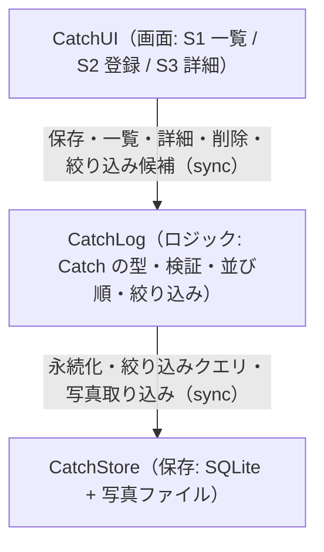

# Components — 友達と使う釣りアプリ（構成要素カタログ）

## Sources

- 上流資料: `../requirements-analysis/requirements.md`（requirements: FR1〜FR5、NFR1〜NFR9）、`../practices-discovery/team-practices.md`（team-practices: 3層、test-after、80%）、`../../ideation/rough-mockups/wireframes.md`（S1／S2／S3）
- 本工程の確認済み回答: `domain-design-questions.md` の Q1〜Q8（本文中では `[Q<n>]` で参照）
- 決定記録: `decisions.md`（ADR-001〜ADR-006）

## Overview（この資料の範囲）

次の釣行までの最小範囲（requirements の FR1〜FR4、Must）を実装するために書くコードの部品を定義する。team-practices の3層（画面／ロジック／保存）を、そのまま3つの部品にする。[Q4] 次の釣行の後の機能（FR5、PU-2〜PU-5）は部品としてはまだ定義せず、「将来の拡張」の節で、どの部品がどう増えるかの見通しだけを書く。

技術スタック（React Native + Expo）と保存方式（SQLite、写真はアプリ専用領域）は `decisions.md` の ADR-001／ADR-003 で決定し、ここでは各部品の外部依存として現れる。[Q1][Q2][Q3]

## Component Catalogue（機械可読）

```yaml
components:
  - name: CatchLog
    summary: 釣果のルールとデータの形を持つロジック層。画面と保存の間に立ち、UI も OS も知らない
    behaviour: >
      釣果1件（Catch）の型と不変条件を定義する。保存前の入力検証を1回だけ行う:
      写真は必須（FR1.1, FR1.2）、サイズ・重さは空か0以上の数値（FR1.4）、魚種・場所は空か文字列（FR1.3）。
      caughtAt は保存時にアプリの時計から自動で設定し、以後変更しない（FR1.5）。
      id は保存時に UUID を生成する（ADR-004）。一覧は caughtAt の新しい順に並べる（FR2.2）。
      魚種・場所による絞り込み条件を受け取り、CatchStore に問い合わせる（FR2.5）。
      絞り込みチップの候補（登録済みの魚種・場所の重複なしの一覧）を返す（Q8）。
      削除は id を指定して CatchStore に依頼する（FR3.2）。
      保存・読み出し・削除の失敗は握りつぶさず、画面が文言に変換できる結果（成功／失敗＋理由）として返す（FR1.6, FR2.7）。
      時計は注入可能にし、テストで固定できるようにする（team-practices）。
    responsibilities:
      - Catch エンティティの定義と不変条件
      - 入力検証（画面→ロジックの境界で1回）
      - id（UUID）と caughtAt の自動付与
      - 一覧の並び順と絞り込み条件の組み立て、絞り込み候補の算出
      - 保存・削除・読み出しの結果を画面向けの成功／失敗に変換
    depends_on:
      - component: CatchStore
        interaction: 釣果の保存・一覧取得（並び順・絞り込み付き）・1件取得・削除・写真ファイルの取り込みを依頼する
        style: sync
    dependents:
      - component: CatchUI
        interaction: 画面の操作（保存・一覧・詳細・削除・絞り込み）を CatchLog の操作に変換して呼ぶ
    external_dependencies: []
    entities:
      - name: Catch
        identifier: id
        attributes: [id, photoPath, thumbnailPath, species, sizeCm, weightG, placeName, caughtAt]
        references: []

  - name: CatchStore
    summary: 端末内の SQLite データベースとアプリ専用領域の写真ファイルを扱う保存層
    behaviour: >
      Catch を SQLite の1行として保存・更新・削除し、caughtAt の降順で一覧を返す（FR2.2, FR4.1）。
      魚種・場所の絞り込みは SQL の条件として実行し、500件でも1秒以内に返す（NFR1）。
      撮影／選択された写真をアプリ専用領域にコピーし、一覧用の縮小版（サムネイル）を生成して、両方のパスを Catch に持たせる（Q3, ADR-003）。
      削除時は行と写真ファイル・縮小版の両方を消す（FR3.2）。
      アプリの完全終了・端末の再起動後もデータが残る（FR4.1, NFR3）。データベースの初期化失敗は致命的エラーとして起動時に検知できる形で返す（team-practices エラー処理）。
      1件1行・自己完結の形で保持し、将来クラウドへ移す際にそのまま書き出せるようにする（FR4.2）。
      通信は一切行わない（FR4.3, NFR4）。
    responsibilities:
      - SQLite のスキーマ定義と初期化（テーブル作成・将来の版上げ）
      - Catch の永続化（保存・一覧・1件取得・削除）と絞り込みクエリ
      - 写真ファイルのコピー・縮小版生成・削除
      - 保存領域の失敗（I/O・容量）を呼び出し元に返す
    depends_on: []
    dependents:
      - component: CatchLog
        interaction: 永続化と写真ファイルの操作を依頼される
    external_dependencies:
      - name: SQLite (expo-sqlite)
        kind: database
        purpose: 釣果1件＝1行の永続化、並び順と絞り込み
      - name: アプリ専用ファイル領域 (expo-file-system)
        kind: object-store
        purpose: 写真の原本と縮小版の保存（他アプリから読めない領域）
      - name: 画像縮小 (expo-image-manipulator)
        kind: other
        purpose: 一覧用の縮小版の生成
    entities: []

  - name: CatchUI
    summary: 一覧（S1）・登録（S2）・詳細（S3）の画面と、カメラ・写真・許可の OS 連携を担う画面層
    behaviour: >
      wireframes の S1／S2／S3 を実装する。S1 は起動時の入口で、新しい順のカード一覧、空の状態、読み込み失敗と再読み込み、上部の魚種・場所チップによる絞り込みと解除、該当0件の文言を持つ（FR2.1〜FR2.8, Q8）。
      S2 は1画面で写真（カメラ／写真から選ぶ、1枚）・魚種・サイズ・重さ・場所を入力し、CatchLog の検証結果を項目の直下に文言で出す。保存中は二重送信を防ぎ、失敗時は入力を保持する。未保存で戻るときは破棄確認を出す（FR1.1〜FR1.8）。
      S3 は大きな写真と項目を表示し、空の項目は出さない。確認付きで削除する（FR3.1〜FR3.3）。
      カメラ・写真の許可が拒否された場合は「写真を添付するには許可が必要です」と表示し、端末の設定画面を開く導線を出す。写真なしでは保存できない（Q6, ADR-005）。
      画面の文言は1か所の文言モジュールにまとめる（team-practices）。CatchStore を直接呼ばず、必ず CatchLog を経由する（ADR-002）。
      タップ領域 44px 以上、写真の代替テキスト、見出しとランドマークを持つ（NFR7）。
    responsibilities:
      - S1／S2／S3 の画面と画面間の遷移
      - 入力フォームの状態管理と、CatchLog の検証結果の表示
      - カメラ／写真選択／許可の OS 連携と、拒否時の案内
      - 絞り込みチップの表示と操作
      - 文言モジュール（画面文言の一元管理）
    depends_on:
      - component: CatchLog
        interaction: 保存・一覧（絞り込み付き）・詳細・削除・絞り込み候補の取得を呼ぶ
        style: sync
    dependents: []
    external_dependencies:
      - name: Expo Camera / Image Picker (expo-image-picker)
        kind: third-party-api
        purpose: カメラ撮影と端末の写真からの選択
      - name: Android 実行時許可 (expo の permissions API)
        kind: other
        purpose: カメラ・写真アクセスの許可要求と拒否時の設定画面への誘導
      - name: 画面遷移 (expo-router)
        kind: other
        purpose: S1／S2／S3 の遷移
    entities: []
```

## Component Diagram（部品の関係）



<!-- Text fallback: CatchUI は CatchLog だけを呼び、CatchLog は CatchStore だけを呼ぶ。一方向の3段で、循環はない。 -->

## Component Summary（部品の一覧）

| Component | Purpose | Depends On | Dependents | Entities Owned |
|-----------|---------|------------|------------|----------------|
| CatchLog | 釣果のルールとデータの形。検証・並び順・絞り込み・id と日時の自動付与 | CatchStore | CatchUI | Catch |
| CatchStore | SQLite への永続化と写真ファイルの管理。通信なし | — | CatchLog | — |
| CatchUI | S1／S2／S3 の画面、カメラ・写真・許可の OS 連携、文言の一元管理 | CatchLog | — | — |

## Entity Ownership（データの持ち主）

| Entity | Owning Component | Identifier | Attributes | References |
|--------|------------------|------------|------------|------------|
| Catch | CatchLog | id | id, photoPath, thumbnailPath, species, sizeCm, weightG, placeName, caughtAt | — |

属性の型・制約・許容値は Functional Design（`entities.md`）で決める。ここでは持ち主と形だけを定める。

## External Dependencies（外部依存）

| Component | Dependency | Kind | Purpose |
|-----------|------------|------|---------|
| CatchStore | SQLite (expo-sqlite) | database | 釣果1件＝1行の永続化、並び順と絞り込み |
| CatchStore | アプリ専用ファイル領域 (expo-file-system) | object-store | 写真の原本と縮小版の保存 |
| CatchStore | 画像縮小 (expo-image-manipulator) | other | 一覧用の縮小版の生成 |
| CatchUI | Expo Camera / Image Picker (expo-image-picker) | third-party-api | カメラ撮影と写真の選択 |
| CatchUI | Android 実行時許可 | other | 許可要求と拒否時の案内 |
| CatchUI | 画面遷移 (expo-router) | other | 画面間の遷移 |

## Rationale（なぜこの分け方か）

| Component | 別の部品にする理由 | 変更の理由が異なる点 |
|-----------|-------------------|----------------------|
| CatchLog | 釣果のルール（必須・検証・並び順）は、画面の見た目や保存の仕組みが変わっても変わらない。テストを外部依存なしで書ける（team-practices: ロジック層の単体テスト、80%） | 要件（記録項目・検証ルール）が変わるとき |
| CatchStore | 端末内保存は次の釣行の後にクラウド同期（FR5.3）へ広がる。保存の仕組みだけを差し替えられるよう分離する（team-practices: 保存層を1モジュールに閉じ込める） | 保存先・保存形式が変わるとき |
| CatchUI | 画面は wireframes に従って最も頻繁に手が入る。OS 連携（カメラ・許可）も画面側に閉じ込め、ロジック層を OS から独立させる | 画面案・操作方法・OS の API が変わるとき |

### 部品の分け方の選択肢（検討した案）

- **Option A — 3部品（CatchLog／CatchStore／CatchUI）**: 長所: 3層のテスト方針と一致、クラウド同期時は CatchStore の差し替えで済む、画面が保存を直接触れない。短所: 最小範囲としては薄い部品が増える。可逆性: 高い（後から統合できる）。
- **Option B — 2部品（CatchCore／CatchUI）**: 長所: 部品が少なく速い。短所: 保存方式の変更でルール側も触る、ロジック層の単体テストが保存に引きずられる。可逆性: 中（後から分割は可能だがテストの組み直しが要る）。
- **Option C — 1部品（catches/ フォルダ内でファイル分けのみ）**: 長所: 最速。短所: 境界がコード上で強制されず、画面→保存の直呼びが混入しやすい。可逆性: 低い（後から切り出すコストが最も高い）。
- **採用: Option A**。[Q4] 理由: team-practices の3層と test-after の順序（ロジック → 保存 → 画面）に部品がそのまま対応し、FR5.3（クラウドへ移す）の変更が CatchStore に閉じる。**Alternatives Rejected**: B は保存方式の変更が波及する、C は境界が守られない（ADR-002 参照）。

## 将来の拡張（FR5、次の釣行の後）— 部品としては未定義

| 機能 | 増える／変わる部品の見通し |
|------|----------------------------|
| FR5.1 グループと招待（PU-2） | 新部品 GroupLog／GroupStore を追加。CatchUI にグループ画面を追加 |
| FR5.2 タイムライン（PU-3） | CatchLog の一覧取得に「誰の釣果か」が加わる。CatchUI の S1 に「自分／みんな」の切り替え |
| FR5.3 クラウド同期（PU-3） | CatchStore の裏に同期用の保存先を追加（CatchLog と CatchUI は変えない） |
| FR5.4 ポイントの地図（PU-4） | 新部品 SpotLog／SpotStore と地図画面。Catch の placeName を Spot への参照に広げる可能性 |
| FR5.5 位置共有（PU-5） | 新部品 LocationShare（位置情報の取得と送信） |
| FR5.6 編集 | CatchLog に更新の検証、CatchStore に更新、CatchUI の S3 に編集導線 |

## Assumptions & Open Questions

- Expo の各モジュール名（expo-sqlite など）は 2026 年時点の標準的な構成を前提にしている。実装時のバージョンで名称や API が変わっていれば、同じ役割のモジュールに読み替える。[assumption]
- サムネイルの寸法・画質は Functional Design で決める。[assumption]
- 写真の位置情報（EXIF の GPS）は、コピー時にそのまま保持する前提。共有（FR5.3）までに取り除くかを決める（requirements の Open Questions）。[assumption]
