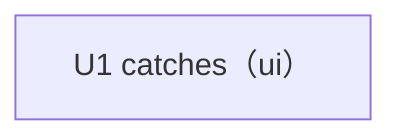

# Unit of Work Dependency — 友達と使う釣りアプリ

## Sources

- 上流資料: `../domain-design/components.md`（components）、`../domain-design/decisions.md`（decisions: ADR-002）、`../requirements-analysis/requirements.md`（requirements）
- 作業単位の定義: `unit-of-work.md`
- 本工程の確認済み回答: `units-generation-questions.md` の Q1〜Q2

## Dependency DAG（依存関係）

作業単位は U1 `catches` の1つだけで、単位間の依存の辺はない。[Q1][Q2]

```yaml
units:
  - name: catches
    kind: ui
    depends_on: []
```



<!-- Text fallback: 作業単位は catches の1つ。依存する単位も、依存される単位もない。 -->

## Integration Points（単位間の連携点）

- 単位が1つなので、単位間の API・共有データ・イベントはない。
- 単位の内部では、domain-design の3部品が CatchUI → CatchLog → CatchStore の一方向で連携する（ADR-002）。この境界は Functional Design の設計と Code Generation のモジュール構成で保つ。
- 将来の単位（FR5: グループ・タイムライン・クラウド同期・地図・位置共有）は今回の図に含めない。次の取り組みで単位を切るとき、`catches` が公開する連携点（Catch の形、CatchStore の裏側の同期先）を Contract Design で定める。

## Parallel Development Opportunities（並行して作れる組み合わせ）

- 単位が1つ、開発者がひとりのため、並行開発の対象はない。
- 単位の内部では、team-practices の順序（ロジック → 保存 → 画面）で直列に作る。

## Assumptions & Open Questions

- None.
